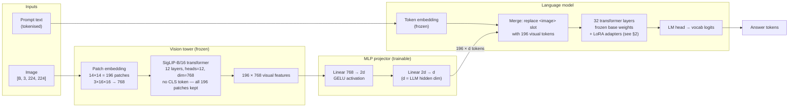
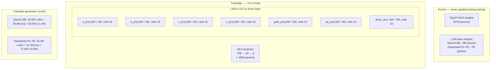
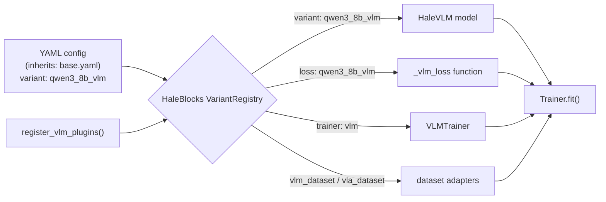
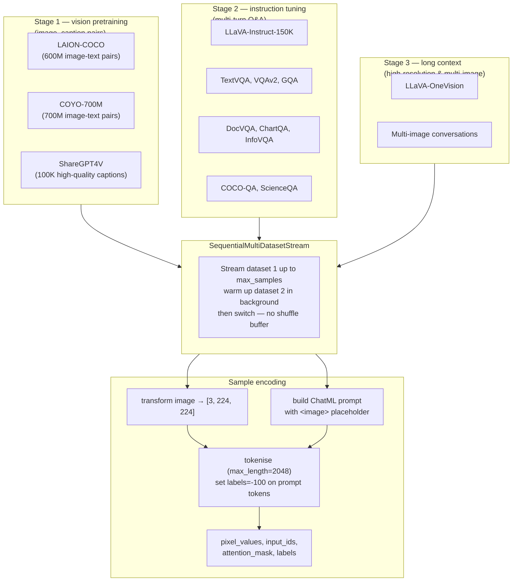
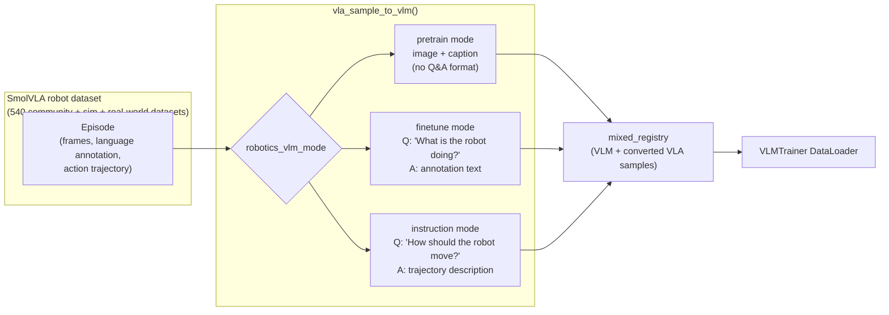
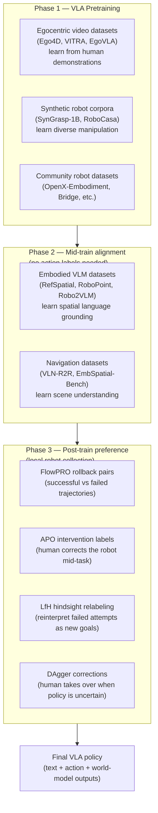
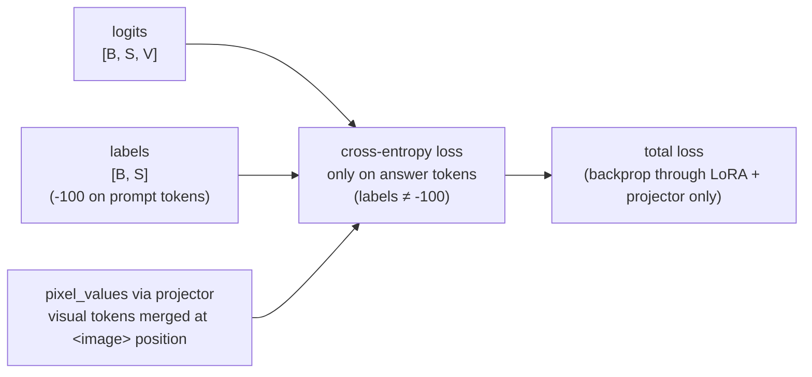

# Architecture

Mermaid diagrams (render on GitHub). They match the [project page](../project-page/index.html)
and Section 3 of the [paper](../paper/main.tex).
For known pipeline issues see [known-issues.md](known-issues.md).

---

## 1. End-to-end model

A frozen vision encoder converts the image to 196 visual tokens. A trainable MLP projector translates those tokens into the LLM's embedding space. The frozen LLM base (Qwen3-8B or DeepSeek-R1-Distill-Qwen-7B) with small LoRA adapters generates the answer.

---

## 2. LoRA adapter placement

Only ~1% of total parameters are updated: the MLP projector (always) and LoRA r=16 adapters on 7 linear modules in every transformer layer.

---

## 3. Plugin wiring (HaleBlocks registry)

---

## 4. SmolVLM data pipeline (three stages)

---

## 5. VLA robot data → VLM samples

---

## 6. Three-phase VLA training pipeline

---

## 7. Loss computation

