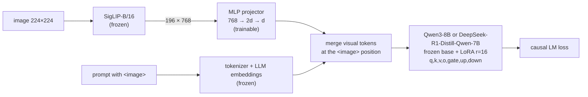
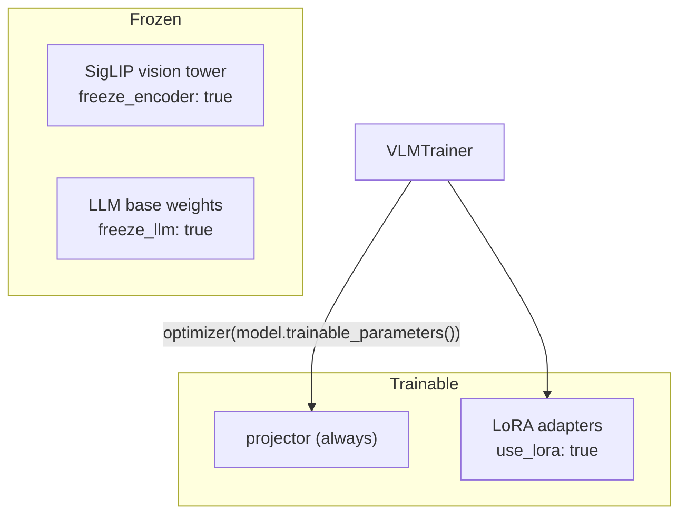
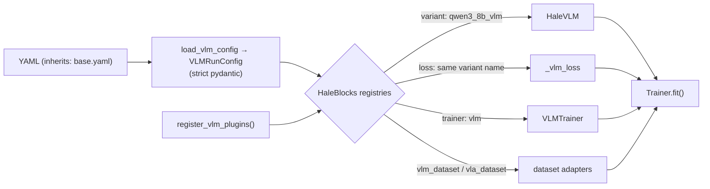
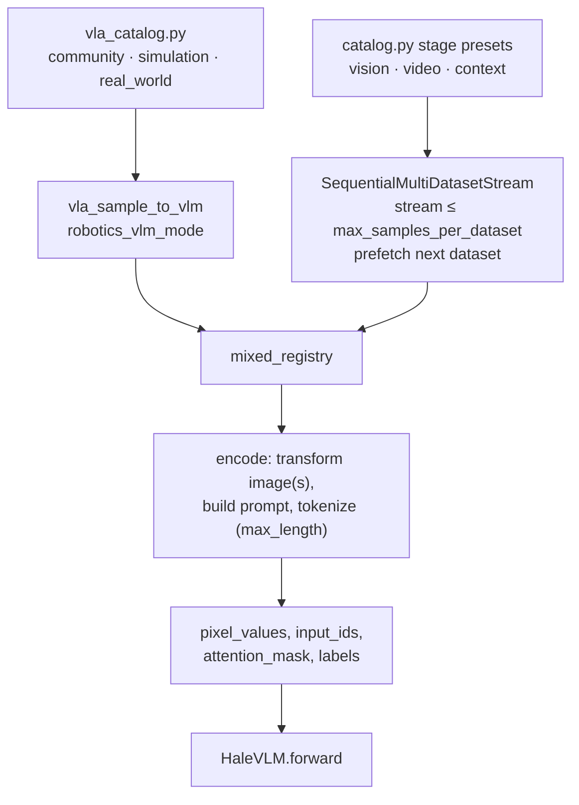

# Architecture

Mermaid diagrams (they render on GitHub). The same figures appear on the
[project page](../project-page/index.html) and in Section 3 of the [paper](../paper/main.tex).

## 1. Model

## 2. What is trained

Trainable budget (computed from the backbone shapes): Qwen3-8B 43.6M LoRA + 39.9M projector ≈ 83.5M
(≈1.0%); DeepSeek-R1-Distill-Qwen-7B 40.4M + 31.2M ≈ 71.6M (≈0.9%).

## 3. Plugin wiring with HaleBlocks

## 4. Data flow

## Known issues

See [known-issues.md](known-issues.md). The merge step in diagram 1 currently
**overwrites** the text that follows `<image>` instead of inserting the visual tokens.
