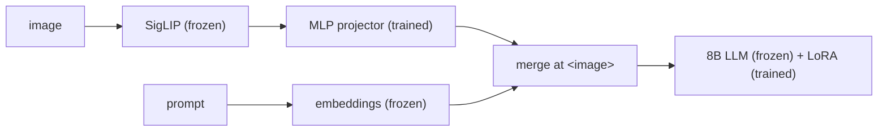

# Giving an 8B reasoning model eyes for about 1% of its parameters

*2026-09-28 · B A NaveenKumar*

> **Summary.** Hale-VLM connects a frozen SigLIP encoder to Qwen3-8B or
> DeepSeek-R1-Distill-Qwen-7B through a small MLP projector and LoRA adapters, which
> means training about 84M or 72M parameters. The interesting parts are around the model:
> a typed registry of the full SmolVLM data recipe, a streaming mixer that never
> downloads a whole corpus, and a way to reuse hundreds of robot datasets as VLM training
> data. This post also covers two input-pipeline bugs found while writing it up.

## The recipe



This is the LLaVA recipe, and it's popular for good reasons: the projector learns to
translate SigLIP's patch features into "words" the LLM already understands, and LoRA lets
the LLM adjust how it attends to them without forgetting its language and reasoning skills.

With rank-16 LoRA on all seven projection matrices of every layer:

| Backbone | LoRA | Projector | Trainable |
|---|---|---|---|
| Qwen3-8B | 43.6M | 39.9M | ≈83.5M (≈1.0%) |
| DeepSeek-R1-Distill-Qwen-7B | 40.4M | 31.2M | ≈71.6M (≈0.9%) |

The `VLMTrainer` hands the optimiser **only** the trainable parameters. That makes the
trainable set explicit, so weight decay, learning-rate groups and parameter counts all
refer to the ~1% that actually changes, and the start-up log line
(`trainable=… / …`) confirms the policy before any GPU time is spent.

## Everything is a plugin

Hale-VLM doesn't have its own training loop. It registers a model, a loss, a trainer and
datasets into [HaleBlocks](https://github.com/basaanithanaveenkumar/HaleBlocks), and a whole
experiment is a YAML file:

```yaml
inherits: base.yaml
data:
  source: registry
  registry_stage: all
  streaming: true
  max_samples_per_dataset: 128
```

That file is the entire SmolVLM mixture config. Changing the backbone, unfreezing the vision
tower or switching to a video-only stage is a one-line diff, and strict schemas reject
typos instead of silently ignoring them.

## The SmolVLM recipe as data, not prose

The SmolVLM paper is unusually precise about its data: which datasets go into the vision
stage, which into video fine-tuning, which extend the context length, and which one they
*removed* because it hurt (SmolTalk: −3.7% video, −6.5% image). Hale-VLM turns that into
a registry. Every dataset is a class with a typed spec (HF path, modality, stage, category,
paper reference), and the rejected one is registered but **disabled**, so asking for it
raises an error that quotes the reason.

Nineteen datasets add up to a lot of terabytes, so the sequential mixer streams one dataset
at a time, stops at `max_samples_per_dataset`, and warms up the next one in a background
thread while the current one is being consumed.

## Robot data as vision-language data

The SmolVLA registry lists 534 community robot datasets plus LIBERO, Meta-World and four
real-world SO-100/101 sets. Even without an action head, these are valuable: real scenes of
tabletops, grippers and household objects, each with a task description. With
`robotics_vlm_mode`, each frame becomes a VLM sample:

- `pretraining`: "Robot task: pick up the red cube"
- `finetuning`: "Execute the following manipulation task: …"
- `instruction_tuning`: "Instruction: … Describe the robot action needed to complete this task."

Mixing these into the SmolVLM stream (`source: mixed_registry`) is a cheap way to make a
VLM more at home in embodied scenes before it ever becomes a VLA.

## Two bugs found while writing this post

Explaining a system in detail is a good way to find its bugs. While tracing exactly what
the LLM receives, two issues turned up:

1. **The image overwrites the instruction.** The prompt has one `<image>` placeholder, but
   the merge step replaces 196 consecutive positions starting there, so the 195 tokens
   after it, usually the question, are dropped. A ten-token reproduction shows it clearly.
   The fix is to expand the placeholder to 196 tokens at tokenisation time, or to insert
   rather than overwrite.
2. **The loss trains on the prompt.** Labels equal the input ids, so the model is also
   trained to predict the user's question, and the template echoes the sample text as the
   answer.

Both are documented in [known-issues.md](../known-issues.md) and in the paper, and both
need fixing before any benchmark numbers mean anything, which is why the paper reports
none yet.

## Next

Fix the input pipeline, then run the vision-stage mixture on both backbones and measure
whether robot frames help or hurt standard VQA. Code, paper and diagrams:
[github.com/basaanithanaveenkumar/Hale-VLM](https://github.com/basaanithanaveenkumar/Hale-VLM).
