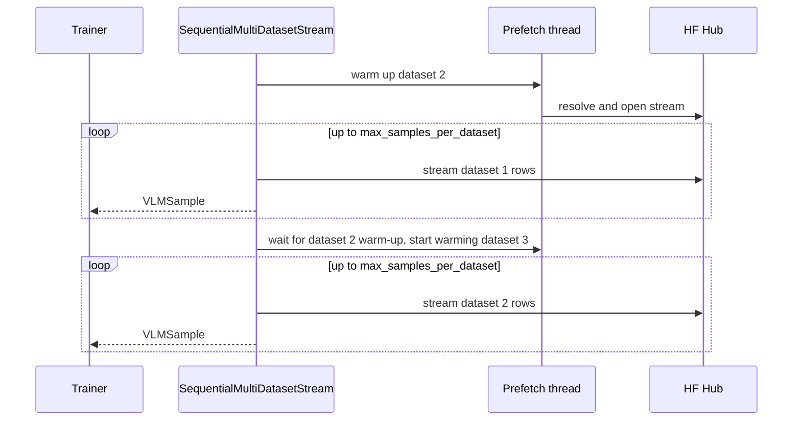

# Data

## SmolVLM registry (19 enabled + 1 rejected)

| Stage | Registry names |
|---|---|
| vision | `the-cauldron`, `docmatix`, `mathwriting`, `llava-onevision-data` |
| video | `llava-video-178k`, `videostar`, `vript`, `sharegpt4video`, `vista-400k`, `moviechat`, `finevideo`, `m4-instruct-data`, `mammoth`, `magpie` |
| context | `dolma-books`, `the-stack`, `fineweb-edu`, `dclm`, `smollm2-math` |
| rejected | `smoltalk` (disabled: hurt video −3.7% and image −6.5% in SmolVLM) |

```python
from hale_vlm.data import list_datasets
list_datasets()                      # 19 names
```

## SmolVLA registry

| Stage | Count | Examples |
|---|---|---|
| community | 534 HF paths | `aergogo--so100_pick_place`, … |
| simulation | 2 | `libero`, `metaworld-mt50` |
| real_world | 4 | `svla-so100-pickplace`, `svla-so100-stacking`, `svla-so100-sorting`, `svla-so101-pickplace` |

## Streaming mixer



## Robotics frames as VLM samples

| `robotics_vlm_mode` | Instruction template |
|---|---|
| `pretraining` | `Robot task: {task}` |
| `finetuning` | `Execute the following manipulation task: {task}` |
| `instruction_tuning` | `Instruction: {task}\nDescribe the robot action needed to complete this task.` |

Samples with more than one camera image become `MULTI_IMAGE` samples. Metadata records
the embodiment and whether action and state were present.
